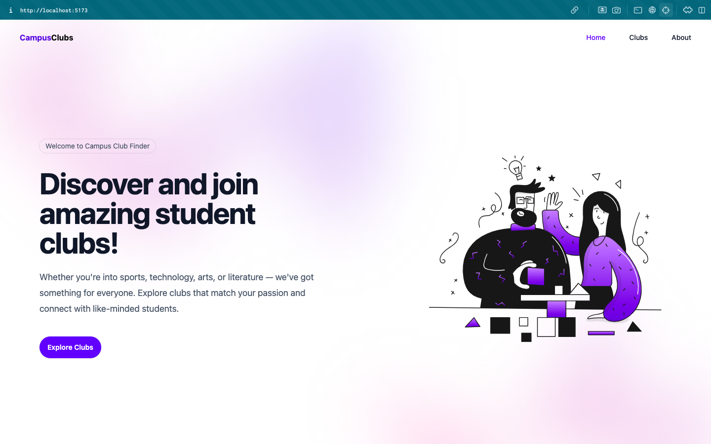
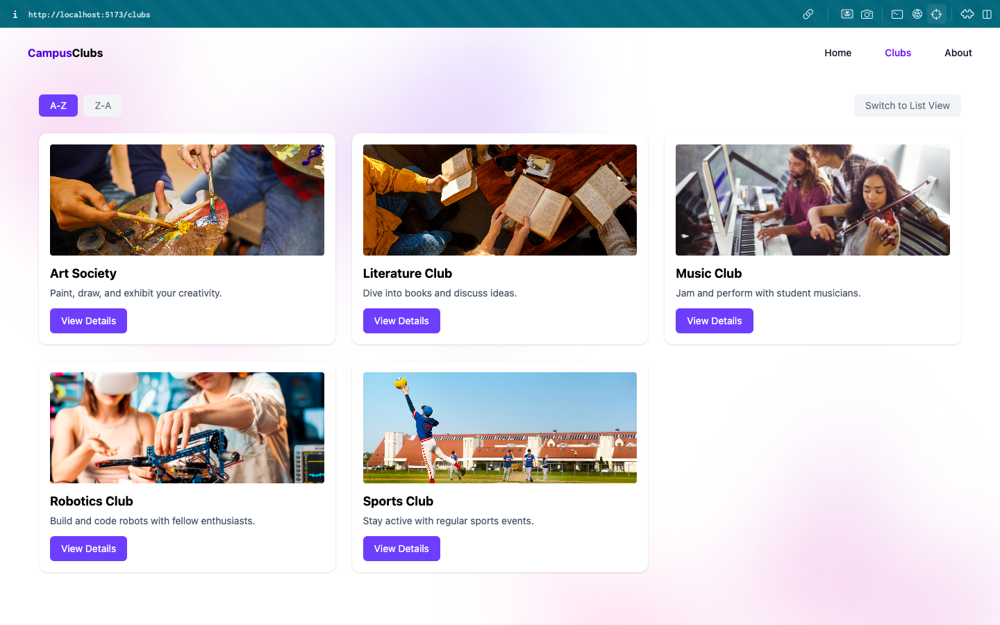
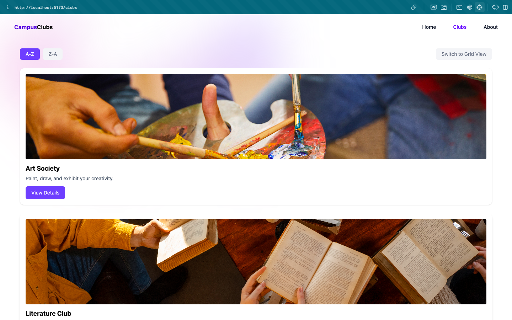
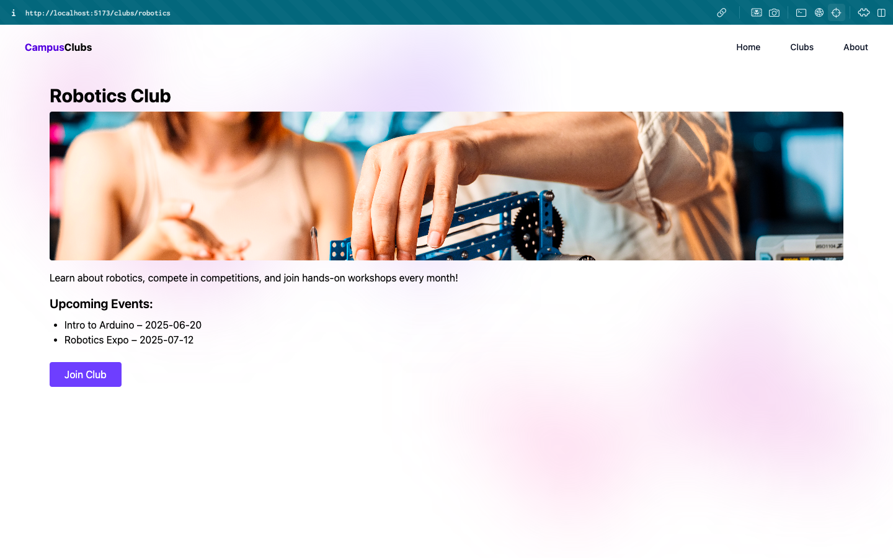
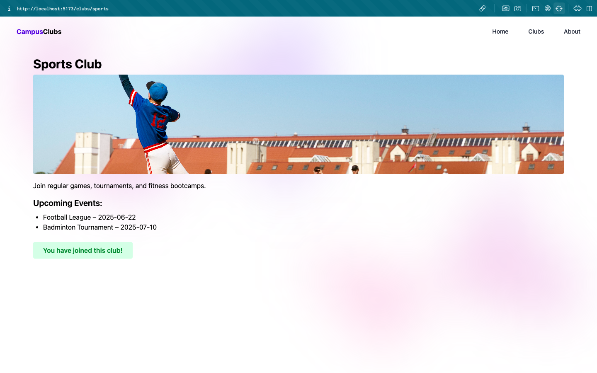
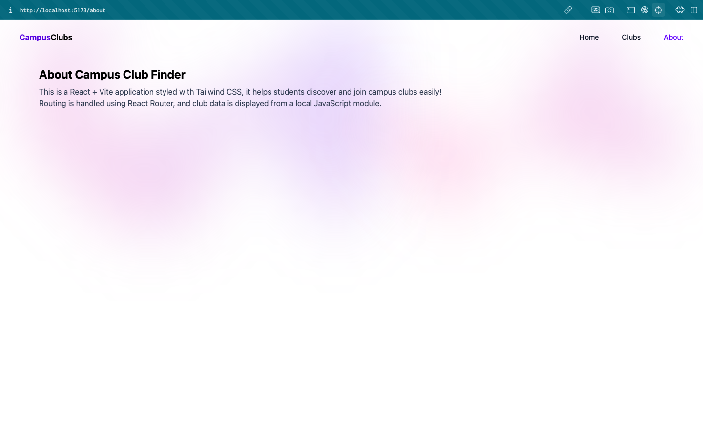
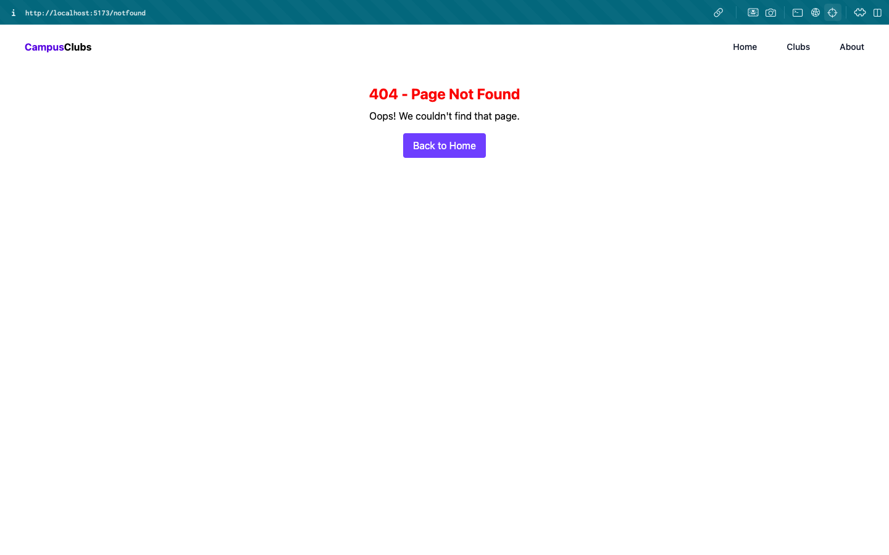

# Campus Club Finder – Documentation

A walkthrough of the Campus Club Finder app built using **Next.js**, **React**, **Tailwind CSS**, and `localStorage` for state persistence.

---

## Overview

Campus Club Finder helps students browse and join campus clubs based on interests. Users can join or leave clubs with a click, and their choices persist using `localStorage`.

---

## Home Page

### Features:
- Welcome Banner
- Headline: “Discover and join amazing student clubs!”
- CTA Button: “Explore Clubs”
- Description text
- Hero illustration

### Screenshot:


---

## Explore Clubs Page (`/clubs`)

### Features:
- Club cards displayed in a responsive grid for mobile, tablet, desktop
- Include ascending and descending sorting & view toggle for grid/list view
- Each card includes:
  - Club Name
  - Image
  - Brief Description
  - View Details Button
- Each card details includes:
  - Club Name
  - Image
  - Full Description
  - List of upcomiing events
  - Join Club Button

### Interactions:
- Clicking **Join Club** adds the club ID to `localStorage`
- Button updates to unclickable **You have joined this club!**
- State persists on reload

### Screenshots:
- 
- 
- 
- 

---

## About Page

- Explanation what the app does and tech stack used

### Screenshot:


---

## Not Found Page

- A friendly not found message, button to go back to Home

### Screenshot:


---
## State Management

- On page load, `useEffect` checks `localStorage` to see if the club is already joined:

```tsx
useEffect(() => {
  const joinedClubs = JSON.parse(localStorage.getItem("joinedClubs")) || [];
  setJoined(joinedClubs.includes(club.id));
}, []);
